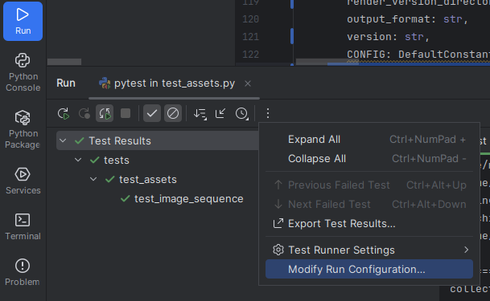

[](https://github.com/michimussato/OpenStudioLandscapes)

---

<!-- TOC -->
* [OpenStudioLandscapes-DagsterCodeLocation-ShotProcessor](#openstudiolandscapes-dagstercodelocation-shotprocessor)
  * [Brief](#brief)
  * [Usage](#usage)
    * [API](#api)
    * [CLI](#cli)
* [Development](#development)
  * [Dagster dev](#dagster-dev)
  * [pytest](#pytest)
<!-- TOC -->

---

# OpenStudioLandscapes-DagsterCodeLocation-ShotProcessor

- [README `png_to_mov`](src/OpenStudioLandscapes/DagsterCodeLocation/ShotProcessor/png_to_mov/README.md)

Status: `WIP`

> [!NOTE]
> 
> This package was scaffolded with `dagster==1.9.11`
> 
> ```shell
> dagster project scaffold --name OpenStudioLandscapes-DagsterCodeLocation-ShotProcessor
> cd OpenStudioLandscapes-DagsterCodeLocation-ShotProcessor
> git init --initial-branch main
> git remote add origin https://github.com/michimussato/OpenStudioLandscapes-DagsterCodeLocation-ShotProcessor.git
> git add *
> git commit -a -m "initial commit"
> git push -u origin main
> ```

## Brief

A package to run post-render jobs on the resulting `EXR` files.

## Usage

### API

- [ ] Todo: Update

```python
from typing import Any, Generator, List, Union

from dagster import (
    OpExecutionContext,
    AssetExecutionContext
)

from OpenStudioLandscapes.DagsterCodeLocation import ShotProcessor

...
```

### CLI

The CLI takes **one input file** and creates **one output file**.
No sequences are supported. This CLI is meant to run 
on a farm where workers can batch process input files individually
in parallel.

```
$ shot-processor --help
usage: shot-processor [-h] [-v] [-vv] --kitsu-task-json KITSU_TASK_JSON --oiio-config-yaml OIIO_CONFIG_YAML --version VERSION --frame-number FRAME_NUMBER --exr-image EXR_IMAGE --output-dir OUTPUT_DIR {create-text-overlay,create-handle-overlay,exr-with-custom-metadata,create-png} ...

Takes an input EXR and creates a new file based on it by specifying the relevant sub-command.

positional arguments:
  {create-text-overlay,create-handle-overlay,exr-with-custom-metadata,create-png}

options:
  -h, --help            show this help message and exit
  -v, --verbose         set loglevel to INFO
  -vv, --very-verbose   set loglevel to DEBUG
  --kitsu-task-json KITSU_TASK_JSON
                        The full path to the Kitsu task JSON file.
  --oiio-config-yaml OIIO_CONFIG_YAML
                        The full path to the OIIO config YAML file.
  --version VERSION     The version (iteration) number.
  --frame-number FRAME_NUMBER
                        The frame number.
  --exr-image EXR_IMAGE
                        The full path to the EXR file.
  --output-dir OUTPUT_DIR
                        The full path to the output base directory. Subdirectories will be created
```

> [!TIP]
> 
> Reinstall this package inside the container it was deployed to
> (i.e. OpenStudioLandscapes-Dagster container):
> 
> ```shell
> docker exec -it <container> bash
> pip3 install \
>     --root-user-action=ignore \
>     --force-reinstall \
>     --editable 'OpenStudioLandscapes-DagsterCodeLocation-ShotProcessor @ git+https://github.com/michimussato/OpenStudioLandscapes-DagsterCodeLocation-ShotProcessor.git@main'
> ```

# Development

## Dagster dev

```shell
pip install --force-reinstall --editable .[dev]

dagster dev --workspace workspace.yaml
```

## pytest

```shell
pip install --editable .[dev]
pytest -s -vv ./tests
```

Add `-s` (equivalent to `--capture=no`) to `pytest` runner
in case `print` or `LOGGER` output is required.

> [!TIP]
> 
> In Pycharm:
> 
